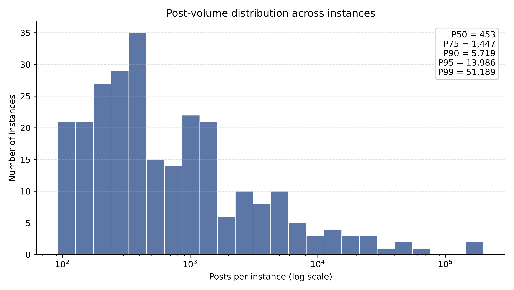

This dataset comprises a large-scale collection of social media posts from the Fediverse (specifically Mastodon), designed to benchmark AI-Generated Text (AIGT) detection. The corpus features a balanced composition of **Human-Written Text (HWT)** collected from the pre-LLM era and **AI-Generated Text (AIGT)** produced using state-of-the-art Large Language Models. This part corresponds to the file `corpus_*.jsonl`.  

Unique to this corpus is the preservation of **community context**. Data is drawn from 263 distinct Mastodon instances, each representing a "community" with specific norms, topics, and moderation policies. This structure enables community-aware modeling and analysis of linguistic shifts across decentralized social networks. This part corresponds to the file `instance_metadata_*.json`.  

Here, the data is divided into three parts.

# 1.Fediverse HWT & AIGT Corpus

## 1.1 Dataset Structure

`corpus_*.jsonl` is provided in `.jsonl` (JSON Lines) format. Each line represents a single post object.

### Data Fields

| Field | Type | Description |
| :--- | :--- | :--- |
| `text` | `string` | The content of the post. |
| `label` | `int` | The classification label. `0` indicates Human-Written Text (HWT), `1` indicates AI-Generated Text (AIGT). |
| `community_id` | `string` | The domain of the Mastodon instance. Represents the community context. |
| `is_reply` | `boolean` | Indicates if the post is a reply to another user (`true`) or a standalone post (`false`). |
| `language` | `string` | The language code of the post (e.g., `ja`, `en`). |
| `generation_method` | `string` | The strategy used to generate the text (for AIGT). For HWT, this may be null or distinct. Strategies include `polish`, `complete`, and `3-iteration paraphrase`. |
| `llm_model` | `string` | The target Large Language Model selected for generation. |
| `response_model` | `string` | The actual model API that generated the response. |

## 1.2 AIGT Generation

AIGT is generated **conditioned on the HWT corpus** to reflect realistic authoring patterns on Mastodon while maintaining **semantic consistency** and **stylistic plausibility**. Each generated post is paired with a corresponding HWT source and **inherits instance / language / post-type metadata**, enabling controlled comparisons under both **post-level** and **community-level** settings.

### Models

AIGT is generated using **seven representative LLMs** spanning major model families:

- GPT-4-Turbo  
- GPT-4o-mini  
- Claude-3.5-Sonnet  
- Claude-Sonnet-4  
- Gemini-2.0-Flash  
- Qwen-2.5-32B  
- LLaMA3-8B-Instruct  

### Generation Strategies (`generation_method`)

We employ **three strategies** widely adopted in prior AIGT generation studies:

- **`polish`**  
  Refines an existing human-written post to improve fluency and coherence **while preserving meaning**, reflecting common post-editing behavior.

- **`complete`**  
  Prompts the model to **naturally continue** a partially written post, simulating interactive writing where users rely on LLMs to finish incomplete thoughts.

- **`3-iteration paraphrase`**  
  Rewrites a post repeatedly over multiple iterations while maintaining **semantic equivalence**, improving stylistic diversity and reducing surface-level artifacts.

# 2 Mastodon Instance-level data

`instance_metadata_*.json` contains the results of crawling **instance-level information** for 263 Mastodon instances, based on the official Mastodon API documentation:

- https://docs.joinmastodon.org/methods/instance/

You will find:
- `instance_metadata_*.json`: successful crawl results (one record per instance)
- `metadata_errors.csv`: failure log (which instance/endpoint failed and why)

---

## 2.1 Data Sources (API Endpoints)

The dataset is built from these Mastodon endpoints:

### Server info
- **View server information (v2)**  
  `GET /api/v2/instance`  
  General server information (preferred).

- **View server information (v1, deprecated)**  
  `GET /api/v1/instance`  
  Used only as a fallback when v2 is unavailable.

### Federation & activity
- **List of connected domains (peers)**  
  `GET /api/v1/instance/peers`  
  Domains the server is aware of.

- **Weekly activity (last ~3 months, weekly bins)**  
  `GET /api/v1/instance/activity`  
  Weekly activity metrics.

### Policies & rules
- **List of rules**  
  `GET /api/v1/instance/rules`

- **Extended description**  
  `GET /api/v1/instance/extended_description`

- **Privacy policy**  
  `GET /api/v1/instance/privacy_policy`

- **Terms of service**  
  `GET /api/v1/instance/terms_of_service`

### Translation
- **Translation languages**  
  `GET /api/v1/instance/translation_languages`  
  Language pairs supported by the server’s configured translation engine.

---

## 2.2 Files

###  `instance_metadata_*.json`

**Purpose**: The main crawl output. Contains one JSON object per instance with the data collected from the endpoints above.

**Format**: JSON array  
- Each element corresponds to one instance (domain).

#### Top-level keys per instance record

| Key | Type | Meaning |
|---|---|---|
| `instance` | string | The instance domain you crawled (target host). |
| `information` | object | General information about the server. |
| `connected_domains` | array[string] | Domains that this server is aware of. |
| `weekly_activity` | array[object] | Server activity over the last 3 months, binned weekly.|
| `list_rules` | array[object] | Rules that the users of this service should follow. |
| `moderated_servers` | array[object] | Obtain a list of domains that have been blocked. |
| `extended_description` | object | Extended description of this server. |
| `privacy_policy` | object | Privacy policy content. |
| `terms_of_service` | object | The contents of this server’s terms of service, if configured. |
| `translation_languages` | object | The contents of this server’s terms of service, for a specified date, if configured. |

#### Notes on specific fields

- **`information`**
  - This is the *raw server info response* (v2 or v1). Fields can differ depending on server version.
  - If your crawler stored metadata like which endpoint was used (e.g., `api_used`), you can rely on it during normalization.

- **`weekly_activity`**
  - Usually contains weekly bins for approximately the last 3 months.
  - Common fields include: `week`, `statuses`, `logins`, `registrations` (exact shape depends on server version).

- **HTML content**
  - `privacy_policy` and `extended_description` commonly include HTML strings (e.g., `content`). Clean/strip HTML before NLP/search indexing.

- **Nullable fields**
  - Some instances do not provide `terms_of_service`, moderation data, or optional sub-fields. Always handle `null` safely.

---

###  `metadata_errors.csv`

**Purpose**: Crawl failure log for debugging and retries.

**Columns**
- `Instance`: instance domain
- `API_Endpoint`: endpoint path that failed (e.g., `/api/v2/instance`, `/api/v1/instance/peers`)
- `Error_Reason`: error message or reason (timeout, DNS, TLS, HTTP error, parse error, etc.)

**Notes**
- The same instance may appear multiple times if different endpoints failed or retries were recorded.

## 2.3 Instance-level statistics and distribution

Top-20 Instances Statistics:

| Instance | Posts | HWT | AIGT | HWT % | AIGT % |
|---|---:|---:|---:|---:|---:|
| mastodon.social | 198,827 | 109,075 | 89,752 | 54.86 | 45.14 |
| pawoo.net | 153,632 | 77,763 | 75,869 | 50.62 | 49.38 |
| mstdn.maud.io | 55,916 | 28,305 | 27,611 | 50.62 | 49.38 |
| chaosphere.hostdon.jp | 48,292 | 24,172 | 24,120 | 50.05 | 49.95 |
| imastodon.net | 44,370 | 22,305 | 22,065 | 50.27 | 49.73 |
| mamot.fr | 38,991 | 20,513 | 18,478 | 52.61 | 47.39 |
| rewa.mobi | 29,088 | 15,774 | 13,314 | 54.23 | 45.77 |
| eletusk.club | 24,218 | 12,223 | 11,995 | 50.47 | 49.53 |
| mstdn.guru | 23,338 | 11,725 | 11,613 | 50.24 | 49.76 |
| pokemon.mastportal.info | 16,083 | 8,159 | 7,924 | 50.73 | 49.27 |
| vocalodon.net | 16,005 | 8,054 | 7,951 | 50.32 | 49.68 |
| framapiaf.org | 15,601 | 8,505 | 7,096 | 54.52 | 45.48 |
| chaos.social | 14,726 | 7,939 | 6,787 | 53.91 | 46.09 |
| handon.club | 14,234 | 7,288 | 6,946 | 51.20 | 48.80 |
| unnerv.jp | 11,757 | 5,884 | 5,873 | 50.05 | 49.95 |
| mental.social | 11,634 | 5,859 | 5,775 | 50.36 | 49.64 |
| social.mikutter.hachune.net | 10,317 | 5,182 | 5,135 | 50.23 | 49.77 |
| mastodon.art | 9,952 | 5,397 | 4,555 | 54.23 | 45.77 |
| mstdn.nere9.help | 9,269 | 4,667 | 4,602 | 50.35 | 49.65 |
| schleuss.online | 7,721 | 3,870 | 3,851 | 50.12 | 49.88 |
| elekk.xyz | 7,425 | 3,884 | 3,541 | 52.31 | 47.69 |
| mastodon.bida.im | 7,247 | 3,980 | 3,267 | 54.92 | 45.08 |
| ffxiv-mastodon.com | 7,067 | 3,544 | 3,523 | 50.15 | 49.85 |
| kancolle.social | 6,076 | 3,072 | 3,004 | 50.56 | 49.44 |
| baraag.net | 5,843 | 3,203 | 2,640 | 54.82 | 45.18 |
| odakyu.app | 5,798 | 2,935 | 2,863 | 50.62 | 49.38 |
| friends.cafe | 5,727 | 2,892 | 2,835 | 50.50 | 49.50 |
| ichiji.social | 5,685 | 2,870 | 2,815 | 50.48 | 49.52 |
| jorts.horse | 5,075 | 2,837 | 2,238 | 55.90 | 44.10 |
| gingadon.com | 4,920 | 2,478 | 2,442 | 50.37 | 49.63 |
| mastodon.sk | 4,654 | 2,370 | 2,284 | 50.92 | 49.08 |

### Post-volume distribution across instances

*Figure: Distribution of post volumes across Mastodon instances. The x-axis is shown on a logarithmic scale.*
